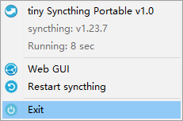

# tiny Syncthing Portable
A small and easy to use syncthing launch for windows.

SyncTrayzor is a great syncthing launcher, but its file size is relatively large (>200MB) and it also requires the Microsoft's net runtime.

So I created this small and easy to use syncthing launcher for windows. It is below 1MB and it doesn't require any third-party software or libraries.


## Build

This syncthing portable is develop with opensource tool [Lazarus](http://www.lazarus-ide.org/), just download and install it, then open project file "SyncthingPortable.lpr", then build.


## Directories and Files

Please download and put file "syncthing.exe" in app folder first (tiny syncthing portable has not contain "syncthing.exe" file), then run tinySyncthingPortable.exe. User data will be saved in "data" folder.


```
Folder
 |- SyncthingPortable.exe
 |- [data]            (syncthing user data file)
 |   | ...
 |   | ...
 |- [App]
     |- syncthing.exe (put syncthing.exe here)
```

## TrayIcon

tiny syncthing portable has a tray icon, you can right click the tray icon to show popmenu.

Tray icon color is changed according to syncthing's status, if syncthing process is not running, it will turn gray.




## Web GUI

tiny syncthing portable has not built-in web gui, you can access syncthing's web gui with url "http://127.0.0.1:8384". Just click "Web GUI" from tray icon popmenu to open syncthing's web gui with default browser.
